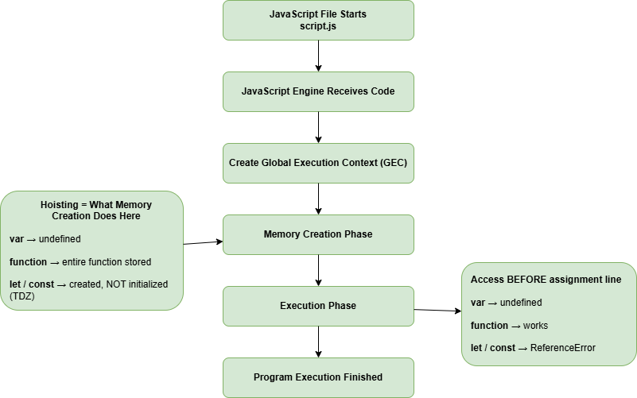

> 🏠 [THE JS MIND](../../README.md)
> →
> [01-Core-Javascript](../README.md)
> →
> **006-Hoisting**


# Hoisting

> **Topic ID:** HO
>
> **Difficulty:** ⭐ Beginner
>
> **Estimated Reading Time:** 20 Minutes
>
> **Prerequisites**
>
> - Variables
> - Execution Context
> - Memory Creation Phase

---

# Why are you here?

You already learned this in the previous lesson.

```javascript
console.log(a);

var a = 10;
```

Output

```text
undefined
```

And someone called this

> "Hoisting."

You accepted the word.

But a word is not understanding.

---

Maybe you've also heard this claim.

> "JavaScript moves your variables to the top of the file."

So you imagine your code secretly rewriting itself like this.

```javascript
var a;

console.log(a);

a = 10;
```

That explanation feels satisfying.

It is also **wrong.**

Nothing moves.

Not one character of your code changes position.

---

If Execution Context already explains this behavior,

why does an entire lesson called "Hoisting" exist?

Because Hoisting is not a **mechanism**.

Hoisting is a **name**.

It is the label developers gave to something Execution Context already does.

This lesson exists to correct the myth,

connect the label to the real mechanism you already learned,

and show you exactly where Hoisting applies — and where it doesn't.

---

# Learning Objectives

By the end of this lesson you should be able to explain

✅ What Hoisting actually is

✅ Why Hoisting is a misleading name

✅ How `var` hoisting differs from `let` / `const` hoisting

✅ How Function Declarations are hoisted completely

✅ How Function Expressions and Arrow Functions are NOT hoisted the same way

✅ Why Hoisting is a side effect of Memory Creation, not a separate step

✅ Predict output in Hoisting-based interview questions

---

# Visual Overview

See



or

[Open Editable Diagram](./assets/diagram.drawio)

The diagram summarizes everything we'll learn in this lesson.

---

# Stop Thinking "Movement"

Before anything else,

delete this picture from your mind.

```
Code

↓

Rearranges Itself

↓

Variables Jump To The Top
```

That picture is fiction.

Replace it with the picture you already built in the previous lesson.

```
JavaScript Starts

↓

Global Execution Context Created

↓

Memory Creation Phase

↓

Execution Phase
```

Hoisting is simply the **name** we give to what happens

during that Memory Creation Phase.

Nothing new is happening.

You are only learning its name.

---

# HO-001 — What is Hoisting?

## 🟢 Beginner Explanation

Hoisting is the observed behavior where you can access variables and functions

**before** the line where they are written —

because JavaScript already reserved space for them in memory

before running any code.

It's not magic.

It's not movement.

It's preparation.

Like a restaurant setting the tables before any guest walks in.

By the time you "arrive" at a line of code during execution,

the memory for that variable already exists.

You are simply asking

> "What's currently sitting in that memory slot?"

---

## 🟡 Technical Explanation

Hoisting is the term used to describe the observable outcome of the

**Memory Creation Phase** of an Execution Context.

During Memory Creation, JavaScript allocates memory for:

- `var` declarations → initialized with `undefined`
- Function Declarations → stored completely
- `let` / `const` declarations → created but left uninitialized (TDZ)

The term "hoisting" does not appear anywhere in the ECMAScript specification.

It is a teaching term used to describe this pre-execution memory setup.

---

## 🔵 Interview Explanation

Hoisting is JavaScript's default behavior of making variable and function

declarations available in memory before code execution begins,

as a result of the Memory Creation Phase of the Execution Context.

`var` is hoisted and initialized with `undefined`.

Function Declarations are hoisted with their full definition.

`let` and `const` are hoisted but remain uninitialized inside the Temporal Dead Zone.

---

# Important

Hoisting is **NOT**

❌ A separate step that happens before Execution Context is created

❌ Code rearranging itself

❌ The same behavior for every declaration type

Hoisting **IS**

✅ A name for what Memory Creation already does

✅ Different depending on `var`, `let`, `const`, or `function`

---

Related Topics

- Execution Context
- Temporal Dead Zone
- Scope

---

# HO-002 — Why Does Hoisting Exist?

Hoisting is not a feature someone deliberately "added."

It is a **consequence** of how Execution Context works.

Remember from the previous lesson:

```
Read Entire File

↓

Prepare Memory

↓

Then Execute
```

Because JavaScript prepares memory for everything **before** running any line,

declarations placed later in the file already have memory reserved for them

by the time execution reaches an earlier line that references them.

That reserved-memory-before-execution behavior

is what developers named

**Hoisting.**

---

# Think Like JavaScript

A file arrives.

↓

Scan the entire file first.

↓

Reserve memory for `var` → `undefined`.

↓

Store Function Declarations completely.

↓

Reserve memory for `let` / `const` → uninitialized (TDZ).

↓

Now begin execution, top to bottom.

If you can visualize this,

Hoisting stops being a "special trick"

and becomes an obvious consequence of something you already understand.

---

# HO-003 — Hoisting of `var`

```javascript
console.log(score);

var score = 100;
```

Memory Creation Phase

```text
score

↓

undefined
```

Execution Phase

```text
console.log(score)

↓

undefined

↓

score = 100
```

Output

```text
undefined
```

`var` is hoisted **and** initialized with `undefined`.

This is why accessing it early doesn't throw an error —

it simply prints the placeholder value.

---

# HO-004 — Hoisting of Function Declarations

```javascript
greet();

function greet() {
    console.log("Hello");
}
```

Memory Creation Phase

```text
greet

↓

Entire Function Stored
```

Execution Phase

```text
greet()

↓

Function Found

↓

Executed
```

Output

```text
Hello
```

Function Declarations are hoisted **completely** — not just their name,

but their entire definition.

This is the only case where hoisting gives you a fully usable value immediately.

---

# HO-005 — Hoisting of `let` and `const`

```javascript
console.log(city);

let city = "Lahore";
```

Memory Creation Phase

```text
city

↓

Created

↓

NOT initialized (TDZ)
```

Execution Phase

```text
console.log(city)

↓

ReferenceError
```

Output

```text
ReferenceError: Cannot access 'city' before initialization
```

`let` and `const` **are** hoisted — memory is reserved for them.

But unlike `var`, they are not initialized with `undefined`.

They stay locked inside the **Temporal Dead Zone** until execution reaches their declaration line.

We study this zone in detail in the next lesson.

---

# HO-006 — Hoisting of Function Expressions and Arrow Functions

```javascript
sayBye();

var sayBye = function () {
    console.log("Bye");
};
```

Ask yourself first:

> What kind of declaration is `sayBye`?

It is a `var` — assigned a function value.

Memory Creation Phase

```text
sayBye

↓

undefined
```

Execution Phase

```text
sayBye()

↓

undefined is not a function

↓

TypeError
```

Output

```text
TypeError: sayBye is not a function
```

Common Confusion

Developers assume any function-looking code hoists like a Function Declaration.

It does not.

Only the **variable** `sayBye` is hoisted — as `undefined`.

The function value is assigned later, during execution.

If `sayBye` had been declared with `let` or `const` instead of `var`,

the result would be a `ReferenceError` (TDZ) instead of a `TypeError`.

---

# Hoisting Summary

| Declaration Type | Hoisted? | Initial Value | Early Access Result |
|---|---|---|---|
| `var` | Yes | `undefined` | `undefined` |
| `function` (Declaration) | Yes | Entire function | Works normally |
| `let` | Yes | Uninitialized (TDZ) | `ReferenceError` |
| `const` | Yes | Uninitialized (TDZ) | `ReferenceError` |
| Function Expression (`var f = function(){}`) | Only the variable | `undefined` | `TypeError` |
| Arrow Function (`var f = () => {}`) | Only the variable | `undefined` | `TypeError` |

This table is worth memorizing — but more importantly, understanding **why** each row is true.

If you understand Memory Creation from the previous lesson,

every row here should feel obvious rather than magical.

---

# 📚 Continue Learning

**⬅ Previous:** [005-ExecutionContext](../005-ExecutionContext/README.md)

**Next →** [thinking.md](./thinking.md)

---

# 🧭 Topic Learning Path

- [x] README.md ← You are here
- [ ] thinking.md
- [ ] decision-tree.md
- [ ] examples.js
- [ ] questions.md
- [ ] practice.js
- [ ] mistakes.md
- [ ] cheatsheet.md