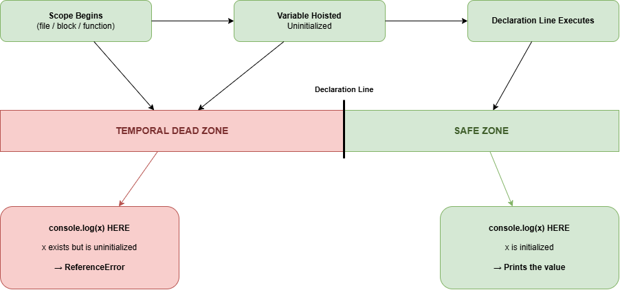

> 🏠 [THE JS MIND](../../README.md)
> →
> [01-Core-Javascript](../README.md)
> →
> **007-TDZ**


# Temporal Dead Zone (TDZ)

> **Topic ID:** TDZ
>
> **Difficulty:** ⭐⭐ Beginner-Intermediate
>
> **Estimated Reading Time:** 18 Minutes
>
> **Prerequisites**
>
> - Execution Context
> - Hoisting

---

# Why are you here?

You've already met this stranger once.

```javascript
console.log(age);

let age = 22;
```

Output

```text
ReferenceError: Cannot access 'age' before initialization
```

In the Hoisting lesson, we said

> "It's hoisted, but it's in the TDZ."

You accepted that phrase.

But you never really unpacked it.

---

Here's the question that exposes the gap.

If `let` **is** hoisted — like we proved in the last lesson —

why does it throw an error at all?

Hoisted things are supposed to be accessible early.

`var` proved that. `function` proved that.

So why does `let` break the pattern?

---

And here's a stranger twist.

```javascript
console.log(typeof age);

let age = 22;
```

Output

```text
ReferenceError: Cannot access 'age' before initialization
```

Wait.

`typeof` on an undeclared variable normally returns `"undefined"` safely.

It doesn't throw.

So why does it throw **here**?

---

These questions all point to one concept you haven't fully met yet.

**The Temporal Dead Zone.**

It is not a separate feature bolted onto `let` and `const`.

It is the **exact time window** between when a variable is hoisted

and when it is initialized.

Once you understand that window,

every strange `let`/`const` error stops feeling strange.

---

# Learning Objectives

By the end of this lesson you should be able to explain

✅ What the Temporal Dead Zone actually is

✅ Why it exists specifically for `let` and `const`

✅ Why `var` has no TDZ

✅ The exact three-stage lifecycle every variable goes through

✅ Why `typeof` fails inside the TDZ (unlike undeclared variables)

✅ How TDZ behaves inside blocks, loops, and function parameters

✅ Predict output before running TDZ-based interview code

---

# Visual Overview

See



or

[Open Editable Diagram](./assets/diagram.drawio)

The diagram summarizes everything we'll learn in this lesson.

---

# Stop Thinking "let is broken"

Before we go further,

delete this idea from your mind.

```
let / const

↓

Randomly throws errors sometimes
```

There is nothing random about it.

Every `let` and `const` declaration passes through the **same three stages**,

in the **same order**, every single time.

Once you can see those three stages,

TDZ behavior becomes 100% predictable — never random.

---

# TDZ-001 — What is the Temporal Dead Zone?

## 🟢 Beginner Explanation

The Temporal Dead Zone is the time gap between

**"this variable now exists in memory"**

and

**"this variable now has a value you're allowed to read."**

During that gap, the variable is technically there —

but touching it is forbidden.

Think of ordering food at a restaurant.

The kitchen has already written your order ticket (it exists).

But the food isn't ready yet.

If you walk into the kitchen and try to take your plate early,

you'll be turned away — not because your order doesn't exist,

but because it isn't ready to be served.

That waiting period, order-placed-but-not-yet-served,

is the Temporal Dead Zone.

---

## 🟡 Technical Explanation

The Temporal Dead Zone (TDZ) is the region of code, from the start of a

scope until a `let` or `const` declaration is executed, during which

that binding exists but is **uninitialized**.

Any attempt to read or write the binding during this region throws a

`ReferenceError`.

The TDZ is not unique to `let`/`const` syntax alone — it is a direct

consequence of how their Memory Creation rule differs from `var`.

---

## 🔵 Interview Explanation

The Temporal Dead Zone is the period between entering a scope and the

actual execution of a `let` or `const` declaration, during which the

variable is hoisted but not initialized. Accessing it in this window

throws a `ReferenceError: Cannot access '<name>' before initialization`.

---

# Important

TDZ is **NOT**

❌ A sign that `let`/`const` are "not hoisted"

❌ A bug or inconsistency in JavaScript

❌ The same thing as "the variable doesn't exist yet"

TDZ **IS**

✅ Proof that `let`/`const` ARE hoisted (only hoisted things can be "in" a zone)

✅ A deliberate safety mechanism

✅ A specific window with a clear start and a clear end

---

Related Topics

- Execution Context
- Hoisting
- Scope

---

# TDZ-002 — Why Does TDZ Exist?

`var` was forgiving.

It let you use a variable before its declaration and just handed you

`undefined` — silently.

That silence caused real bugs.

Code would run without errors, but behave incorrectly,

because a variable was read before it was meant to be.

`let` and `const` were designed to fix this.

Instead of silently returning `undefined`,

they refuse access entirely until the declaration line has actually run.

```
var

↓

"Here, have undefined, no questions asked."

--------------------------------

let / const

↓

"Not yet. Ask me again after my declaration line runs."
```

The TDZ turns a silent bug into a loud, immediate error —

exactly when and where the mistake happens.

---

# Think Like JavaScript

A scope begins (file, block, or function).

↓

Memory Creation reserves space for every `let`/`const` in that scope.

↓

Each one is marked "uninitialized" — this is the START of the TDZ.

↓

Execution begins, line by line.

↓

The moment the engine reaches the declaration line,

the variable becomes initialized — this is the END of the TDZ.

↓

From this point onward, the variable behaves normally.

If you can visualize this timeline,

TDZ becomes a location on a line — not a mystery.

---

# TDZ-003 — The Three-Stage Lifecycle

Every `let` and `const` variable passes through exactly three stages,

in this exact order.

```
Stage 1: Uninitialized (TDZ starts)

↓

Stage 2: Initialized (TDZ ends — the declaration line executes)

↓

Stage 3: Assigned / Reassigned (only applies to let; const stops here)
```

Example

```javascript
// -------- Stage 1 starts here (scope begins) --------

console.log(score); // ❌ ReferenceError — still in Stage 1

let score = 10; // -------- Stage 2: initialized --------

console.log(score); // ✅ 10

score = 20; // -------- Stage 3: reassigned (let only) --------

console.log(score); // ✅ 20
```

`const` also goes through Stage 1 and Stage 2 — it is NOT exempt from TDZ.

It simply skips Stage 3, because reassignment isn't allowed.

---

# TDZ-004 — Why Does `typeof` Fail Inside the TDZ?

Normally, `typeof` is considered "safe" —

it never throws, even for variables that were never declared at all.

```javascript
console.log(typeof neverDeclared); // "undefined" — no error
```

But this throws:

```javascript
console.log(typeof age); // ❌ ReferenceError

let age = 22;
```

Why the difference?

```
neverDeclared

↓

Doesn't exist in memory AT ALL

↓

typeof safely reports "undefined"

--------------------------------

age

↓

DOES exist in memory (hoisted)

↓

But is uninitialized (TDZ)

↓

typeof still has to "touch" it to check its type

↓

Touching a TDZ binding → ReferenceError
```

The safety of `typeof` only applies to variables that were never created.

A TDZ variable was created — it's simply locked — and `typeof` isn't exempt

from that lock.

---

# TDZ-005 — TDZ Inside Blocks and Loops

TDZ isn't limited to the top of a function or file.

It applies to **every block scope** independently.

```javascript
{
    console.log(city); // ❌ ReferenceError

    let city = "Karachi";
}
```

Each `{ }` block creates its own mini-scope, and its own TDZ,

for any `let`/`const` declared inside it.

This also affects loops:

```javascript
for (let i = 0; i < 3; i++) {
    console.log(i);
}
```

Here, each loop iteration gets a **fresh** `let i` binding,

with its own tiny TDZ, initialized at the start of that iteration.

This is part of why `let` behaves more predictably than `var` inside loops —

a topic you'll explore further in Closures.

---

# TDZ Summary

| Concept | Behavior |
|----------|--------------|
| Is the variable hoisted? | Yes — always |
| Is it initialized immediately? | No — starts uninitialized |
| Accessing it before declaration | `ReferenceError` |
| `typeof` on it before declaration | `ReferenceError` (not `"undefined"`) |
| When does TDZ end? | The moment its declaration line executes |
| Does `var` have a TDZ? | No — `var` is initialized with `undefined` immediately |
| Does `const` have a TDZ? | Yes — identical to `let` until initialization |
| Is TDZ scoped per block? | Yes — every `{ }` has its own TDZ per `let`/`const` |

This table is worth memorizing — but more importantly, understanding.

If you understand the three-stage lifecycle, you'll never be surprised by

a `let`/`const` error again.

---

# 📚 Continue Learning

**⬅ Previous:** [006-Hoisting](../006-Hoisting/README.md)

**Next →** [thinking.md](./thinking.md)

---

# 🧭 Topic Learning Path

- [x] README.md ← You are here
- [ ] thinking.md
- [ ] decision-tree.md
- [ ] examples.js
- [ ] questions.md
- [ ] practice.js
- [ ] mistakes.md
- [ ] cheatsheet.md